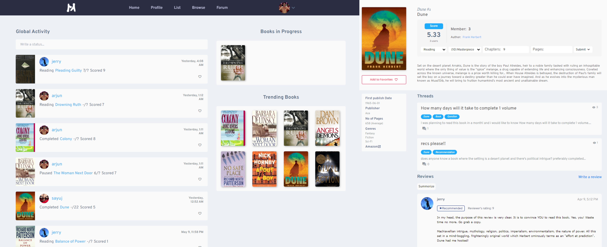

# MizuList - Your Personal Book Reading Tracker

  

MizuList is a dynamic book reading tracker designed to transform your reading experience. Seamlessly merging innovative technology with the joy of reading, MizuList empowers you to discover, track, and engage with your favorite books like never before.

## Overview

MizuList is a project born out of a passion for literature and a drive to enhance the way we interact with books. It provides users with a comprehensive platform to track their reading progress, explore new books, connect with a community of book enthusiasts, and gain insights into their reading habits. Powered by SvelteKit and backed by postgresql via Prisma, MizuList offers a modern and efficient solution for managing your reading journey.

## Features

- **Personalized Tracking:** Keep tabs on your reading progress, mark favorites, and organize your book collection with ease.
- **Comprehensive Book Details:** Access detailed book information fetched from the Open Library API, enhancing your understanding of each title.
- **Community Engagement:** Connect with fellow book enthusiasts, share your thoughts, recommend books, and engage in conversations.
- **Forum:** Participate in discussions, ask questions, and share insights with other members of the community.
- **Ai-Recommendation:** Receive personalized book recommendations based on your reading history and preferences.
- **Community Recommendation:** Explore books recommended by other users and contribute your own recommendations.
- **Review Summerizer:** Summarize book reviews to quickly gauge opinions and make informed decisions about what to read next.
- **Insightful Statistics:** Gain valuable insights into your reading habits, preferences, and trends through interactive statistics.
- **Customization:** Personalize your profile with avatars, bios, and unique usernames that reflect your reading identity.
- **Future-Ready:** Built on cutting-edge technology, MizuList leverages SvelteKit and postgresql via Prisma to provide a seamless and responsive user experience.
